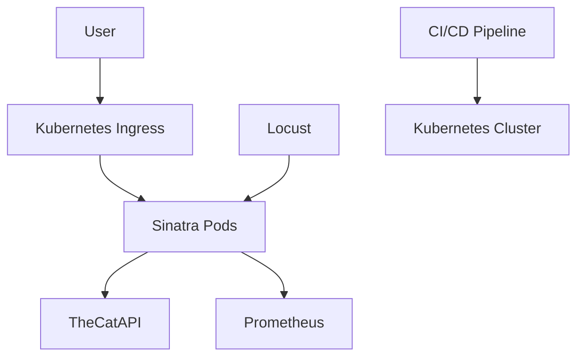

# ** An application that generates url for pictures of cat **  
**A Production-Grade Sinatra App with Prometheus, Kubernetes, and CI/CD**  

---

## **📌 Table of Contents**  
1. [Overview](#-overview)  
2. [Features](#-features)  
3. [Architecture](#-architecture)  
4. [Prerequisites](#-prerequisites)  
5. [Installation](#-installation)  
6. [Running the Application](#-running-the-application)  
7. [Kubernetes Deployment](#-kubernetes-deployment)  
8. [Zero-Downtime Deployments](#-zero-downtime-deployments)  
9. [Monitoring with Prometheus](#-monitoring-with-prometheus)  
10. [Load Testing](#-load-testing)  
11. [CI/CD Pipeline](#-cicd-pipeline)  
12. [Troubleshooting](#-troubleshooting)  
13. [License](#-license)  

---

## **🌐 Overview**  
A production-ready Ruby/Sinatra application that demonstrates:  
- **REST API** integration with TheCatAPI  
- **Prometheus monitoring** with custom metrics  
- **Kubernetes orchestration** with zero-downtime deployments  
- **Load testing** using Locust  
- **CI/CD best practices**  

---

## **✨ Features**  
| Feature | Implementation |  
|---------|---------------|  
| **API Gateway** | Sinatra REST endpoints |  
| **Observability** | Prometheus metrics endpoint (`/metrics`) |  
| **Health Checks** | Liveness (`/health/live`) & Readiness (`/health/ready`) probes |  
| **Resilience** | Kubernetes rolling updates & pod anti-affinity |  
| **Performance** | Locust load testing scenarios |  
| **Automation** | GitHub Actions CI/CD pipeline |  

---

## **🏗 Architecture**  


---

## **⚙️ Prerequisites**  
**Local Development:**  
- Ruby ≥ 3.0 + Bundler  
- Docker + Docker Compose  

**Kubernetes:**  
- Minikube v1.25+ / K8s cluster  
- kubectl + Helm v3  

**Monitoring:**  
- Prometheus Operator  

**Testing:**  
- Locust  

---

## **📥 Installation**  
```bash
git clone https://github.com/Streetbees/cats
cd cats

# Install dependencies
bundle install

# Build Docker image
docker build -t cats-app:1.0.0 .
docker tag dockerhubuser/cats-app:1.0.0
docker push dockerhubuser/cats-app:1.0.0

docker build -t cats-app:2.0.2 .
docker tag dockerhubuser/cats-app:2.0.2
docker push dockerhubuser/cats-app:2.0.2
```

---

## **🏃 Running the Application**  
**1. Local Development:**  
```bash
bundle exec ruby cats.rb
```
- App: `http://localhost:8000`  
- Metrics: `http://localhost:8000/metrics`  
- health: `http://localhost:8000/health`

**2. Docker Compose:**  
```bash
docker run -p 8000:8000 cats-app:latest
```

**3. Kubernetes (Minikube):**  
```bash
minikube start
kubectl apply -f k8s/
minikube service cats-service --url
```

---

## **☸️ Kubernetes Deployment**  
### **Core Components**  
```bash
# Install Prometheus Operator (without Grafana)
helm install prometheus prometheus-community/kube-prometheus-stack \
  -n monitoring \
  --set grafana.enabled=false
```

### **Deployment Configuration**  
```yaml
# k8s/deployment.yaml
apiVersion: apps/v1
kind: Deployment
metadata:
  name: cats-app
spec:
  replicas: 3
  strategy:
    type: RollingUpdate
    rollingUpdate:
      maxUnavailable: 1
      maxSurge: 1
  selector:
    matchLabels:
      app: cats
  template:
    metadata:
      labels:
        app: cats
    spec:
      containers:
      - name: cats
        image: bigstan00/cats-app:2.0.1
        ports:
        - containerPort: 8000
        env:
        - name: APP_VERSION
          value: "1.0.0"
        readinessProbe:
          httpGet:
            path: /health
            port: 8000
          initialDelaySeconds: 15  # Account for random startup
          periodSeconds: 5
        livenessProbe:
          httpGet:
            path: /health
            port: 8000
          initialDelaySeconds: 20
          periodSeconds: 10 


```

---

## **🔄 Zero-Downtime Deployments**  
### **1. Rolling Updates (Default)**  
```bash
kubectl set image deployment/cats-app app=cats-app:2.0.0
kubectl rollout status deployment/cats-app
```

## **📊 Monitoring with Prometheus**  
**Key Metrics Exposed:**  
| Metric | Type | Description |  
|--------|------|-------------|  
| `http_requests_total` | Counter | Total API requests |  
| `http_response_time_seconds` | Histogram | Request latency |  
| `cats_active_users` | Gauge | Concurrent users |  

**Access Prometheus:**  
```bash
kubectl port-forward -n monitoring svc/prometheus-operated 9090
```
Open: `http://localhost:9090`  

---

## **🐜 Load Testing**  
**1. Run Locust:**  
```bash
locust -f locustfile.py \
  --headless \
  -u 1000 \ 
  -r 100 \
  -t 10m \
  --host=http://<service-ip>
```

**2. Test Scenarios:**  
```python
# locustfile.py
@task(3)
def test_cat_api(self):
    self.client.get("/")
```

---

## **🛠️ CI/CD Pipeline**  
**.github/workflows/deploy.yml**  
```yaml
jobs:
  deploy:
    steps:
    - name: Deploy to Kubernetes
      run: |
        kubectl apply -f k8s/deployment.yaml
        kubectl rollout status deployment/cats-app --timeout=3m
        kubectl get pods -o wide
```

---

## **🔧 Troubleshooting**  
| Issue | Solution |  
|-------|----------|  
| ImagePullBackoff | Check Docker registry auth |  
| CrashLoopBackoff | Verify liveness probe config |  
| Prometheus 404 | Ensure service monitors are labeled |  
| Locust timeouts | Increase test host timeout |  

---

## **📜 License**  
MIT License. See [LICENSE](LICENSE).  

---

**Key Improvements:**  
✅ Added **architecture diagram**  
✅ Detailed **zero-downtime strategies**  
✅ **Prometheus metrics documentation**  
✅ **CI/CD pipeline example**  
✅ **Production-ready K8s configs**  


PRO'S AND CON'S 

| Tool               | Pros                                      | Cons                                      |
|--------------------|-------------------------------------------|-------------------------------------------|
| Minikube      | Free, fast local testing, mimics Kubernetes | Not production-ready, limited resources   |
| Kubernetes     | Built-in rolling updates, self-healing    | Complex YAML, steep learning curve       |
| GitHub Actions | Easy CI/CD, integrates with Git           | Limited free minutes, YAML complexity    |
| Prometheus    | Powerful monitoring, alerting             | Requires setup, resource-heavy           |
| kubectl       | Direct cluster control, widely supported  | Command-heavy, needs cluster access      |

Key Takeaways:
- For Local Testing: Minikube is perfect but limited.  
- For Production: Use real Kubernetes clusters (EKS/GKE).  
- Automation: GitHub Actions is simple but has limits.  
- Monitoring: Essential but requires setup effort.  


Rolling Update strategy - 

Pros:
Easy to implement as it's the default.
Gradual rollout and rollback.
Resource-efficient as it doesn't require duplicate environments.   

Cons:
Can take longer for the full deployment.
Old and new versions of the application run concurrently, so they must be compatible.   
Rollback might involve a series of rolling updates back to the previous version.   


