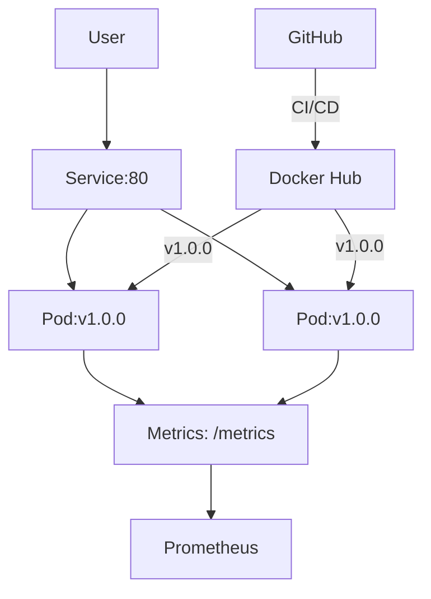

# 🐱 Cats Application Deployment Platform


---

## 📚 Table of Contents

- [Technologies Used](#technologies-used)
- [Features](#features)  
- [Prerequisites](#prerequisites)
- [Quick Start](#quick-start)
- [Application Architecture](#application-architecture)
- [Detailed Setup](#detailed-setup)
- [Dockerization](#dockerization)
- [Kubernetes Manifests](#kubernetes-manifests)
- [Monitoring & Metrics](#monitoring--metrics)
- [CI/CD Pipeline](#cicd-pipeline)  
- [Rollback Procedures](#rollback-procedures)
- [Rolling Update Strategy](#rolling-update-strategy)
- [Troubleshooting](#troubleshooting)
- [Version History](#version-history)
- [Key Takeaways](#key-takeaways)

---

## 🧰 Technologies Used

| Category           | Technologies                          |
|-------------------|----------------------------------------|
| Application        | Ruby 2.7, Sinatra 2.2, Puma 5.6        |
| Containerization   | Docker, Docker Hub                    |
| Orchestration      | Kubernetes 1.28, Minikube             |
| Monitoring         | Prometheus, Grafana (optional)        |
| CI/CD              | GitHub Actions                        |
| Infra Resilience   | HPA, PDB, ServiceMonitor              |

---

## ✨ Features

- Zero-downtime deployments via Kubernetes rolling updates  
- Dockerized Ruby/Sinatra microservice with multi-stage builds  
- Health checks via `/health` endpoint  
- Prometheus-ready metrics via `/metrics` endpoint  
- Auto-scaling with Horizontal Pod Autoscaler (HPA)  
- Pod Disruption Budget (PDB) ensures high availability  
- CI/CD with GitHub Actions & support for automated rollback  
- Versioned deployments for traceability and safety  

---

## 💾 Prerequisites

### Local Development Setup

Install the following:

- [Ruby 3.3.0](https://www.ruby-lang.org/)
- [Bundler](https://bundler.io/)
- [Docker](https://www.docker.com/)
- [Minikube](https://minikube.sigs.k8s.io/)
- [`kubectl`](https://kubernetes.io/docs/tasks/tools/)

### Install Dependencies

```bash
bundle install
```

Start your Minikube cluster:

```bash
minikube start --driver=docker --cpus=4 --memory=8192
```

---

## 🚀 Quick Start

### Deploy Version 1.0.0

```bash
docker build -t bigstan00/cats-app:1.0.0 .
docker run -p 8000:8000 cats-app:1.0.0
docker tag cats-app:1.0.0 bigstan00/cats-app:1.0.0
docker push bigstan00/cats-app:1.0.0
kubectl apply -f k8s/
```

### Access the App and Health Check

```bash
minikube service cats-service
curl $(minikube service cats-service --url)/health
```

---

## 🏗 Application Architecture



---

## 🔧 Detailed Setup

### Metrics and Health Endpoints

Defined in `cats.rb` using Sinatra:

```ruby
get '/health' do
  content_type :json
  {
    status: 'OK',
    version: ENV['APP_VERSION'],
    metrics: '/metrics'
  }.to_json
end

get '/' do
  start_time = Time.now
  REQUEST_COUNTER.increment(method: 'GET', path: '/')
  response = { message: "Welcome to Cats API v#{ENV['APP_VERSION']}" }.to_json
  RESPONSE_TIME.observe(Time.now - start_time)
  response
end

get '/metrics' do
  content_type 'text/plain'
  Prometheus::Client.configuration.data_store.values.to_text
end
```

Dependencies declared in `Gemfile`:

```ruby
gem 'sinatra', '~> 2.2'
gem 'puma', '~> 5.6'
gem 'prometheus-client', '~> 2.1'
gem 'rack-prometheus', '~> 1.1'
```

---

## 📦 Dockerization

Multi-stage Dockerfile:

```dockerfile
FROM ruby:2.7.6-slim as builder
WORKDIR /app
COPY Gemfile* .
RUN bundle install --jobs=4 --retry=3

FROM ruby:2.7.6-slim
COPY --from=builder /usr/local/bundle /usr/local/bundle
COPY . .
EXPOSE 8000
CMD ["bundle", "exec", "puma", "-C", "config/puma.rb"]
```

---

## 📂 Kubernetes Manifests

- `deployment.yaml` – includes rolling update strategy and probes  
- `service.yaml` – exposes the service using `LoadBalancer` or `NodePort`  
- `hpa.yaml` – defines CPU/memory-based autoscaling rules  
- `pdb.yaml` – ensures minimum number of running pods  
- `prometheus.yaml` – enables metrics collection via ServiceMonitor  

---

## 📈 Monitoring & Metrics

Prometheus scrapes `/metrics` endpoint:

```bash
kubectl port-forward svc/cats-service 8080:80
curl http://localhost:8080/metrics
```

Check Prometheus targets at `http://localhost:9090/targets`.

---

## ⚙️ CI/CD Pipeline

### GitHub Actions Workflow

Triggered by push to `master`, tags like `v*`, or manually with rollback:

```yaml
on:
  push:
    branches: [master]
    tags: ['v*']
  workflow_dispatch:
    inputs:
      revision:
        description: 'Rollback revision'
        required: false
```

Steps include building the Docker image, updating Kubernetes deployment, and optionally rolling back.

---

## 🖙 Rollback Procedures

### Manual

```bash
kubectl rollout history deployment cats-app
kubectl rollout undo deployment cats-app --to-revision=1
```

### GitHub Actions Rollback

Trigger the workflow with a `revision` input for automatic rollback.

---

## 🔀 Rolling Update Strategy

Kubernetes' rolling update strategy gradually replaces pods with new versions without downtime.

### ✅ Pros

- Easy to implement — it’s the **default strategy** in Kubernetes
- Supports **gradual rollout and rollback**
- **Resource-efficient** — no need for duplicate environments

### ⚠️ Cons

- **Slower deployments** for large-scale apps
- Requires **backward compatibility** between old and new versions (since both run simultaneously)
- **Rollback** might trigger another rolling update, making full reversions slower

---

## 🛯 Troubleshooting

| Issue               | Resolution                                                     |
|--------------------|----------------------------------------------------------------|
| `ImagePullBackOff` | Ensure image is public or use Docker credentials secret        |
| `CrashLoopBackOff` | Check logs via `kubectl logs <pod-name>`                       |
| `no endpoints`     | Verify service selector matches deployment pod labels          |
| Metrics not showing| Confirm ServiceMonitor label selectors are correct             |

Useful Commands:

```bash
kubectl describe deployment cats-app
kubectl logs -f <pod-name>
kubectl get pods -o jsonpath='{.items[*].spec.containers[*].image}'
```

---

## 📦 Version History

| Version | Tag                        | Description                              |
|---------|----------------------------|------------------------------------------|
| 1.0.0   | `bigstan00/cats-app:1.0.0` | Basic health check setup                 |
| 2.0.1   | `bigstan00/cats-app:latest`| Prometheus metrics + HPA integration     |

---

## 📌 Key Takeaways

- **Minikube** is great for development, but consider EKS or GKE for production.
- **GitHub Actions** is simple to use and supports manual rollbacks.
- **Prometheus Monitoring** improves observability but needs configuration.
- **Rolling Updates** offer safety but require version compatibility.

---

